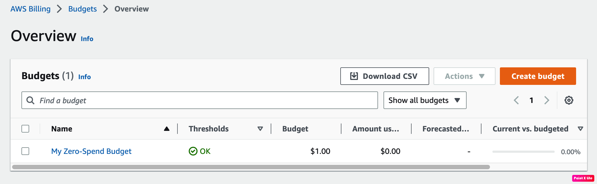
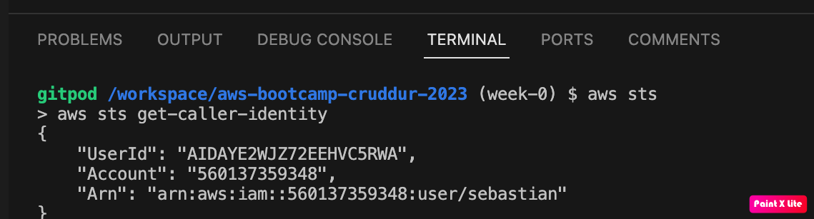
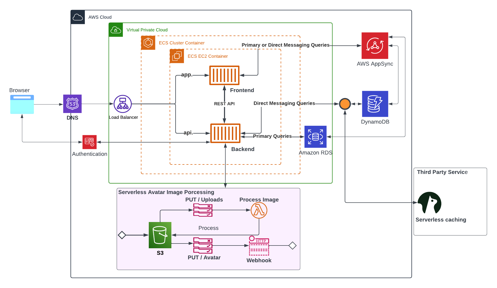

# Week 0 — Billing and Architecture

## Homework

### Setting a Budget : Done

### Configuring AWSCLI into Gitpod: Done

### Rereating Logical Diagram using Lucid Charts: Done

[Source](https://lucid.app/lucidchart/bd9e0c8b-aee8-4dd3-9d57-3a134904b558/edit?viewport_loc=-976%2C-776%2C1284%2C1712%2C0_0&invitationId=inv_a642497a-eaec-42b7-ae4e-911f3abadf28)
